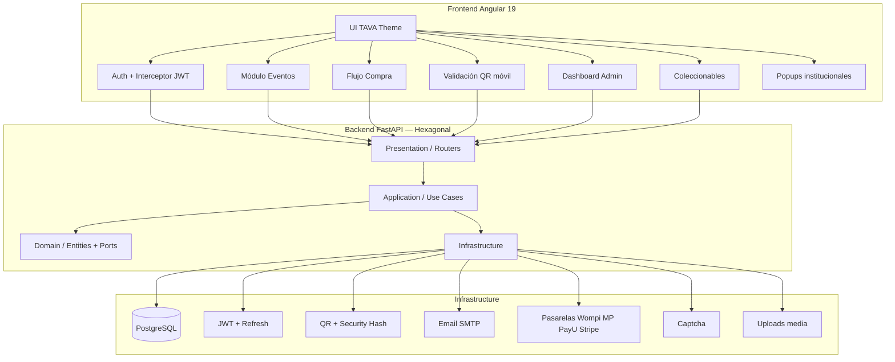

# Diagrama de Componentes — TAVA

## Capas hexagonales (backend)

| Capa | Responsabilidad |
|------|-----------------|
| `domain` | Entidades, enums, interfaces de repositorio |
| `application` | Casos de uso (auth, validación, fidelización) |
| `infrastructure` | SQLAlchemy, JWT, captcha, email, pagos |
| `presentation` | Routers FastAPI, schemas Pydantic, OpenAPI |
