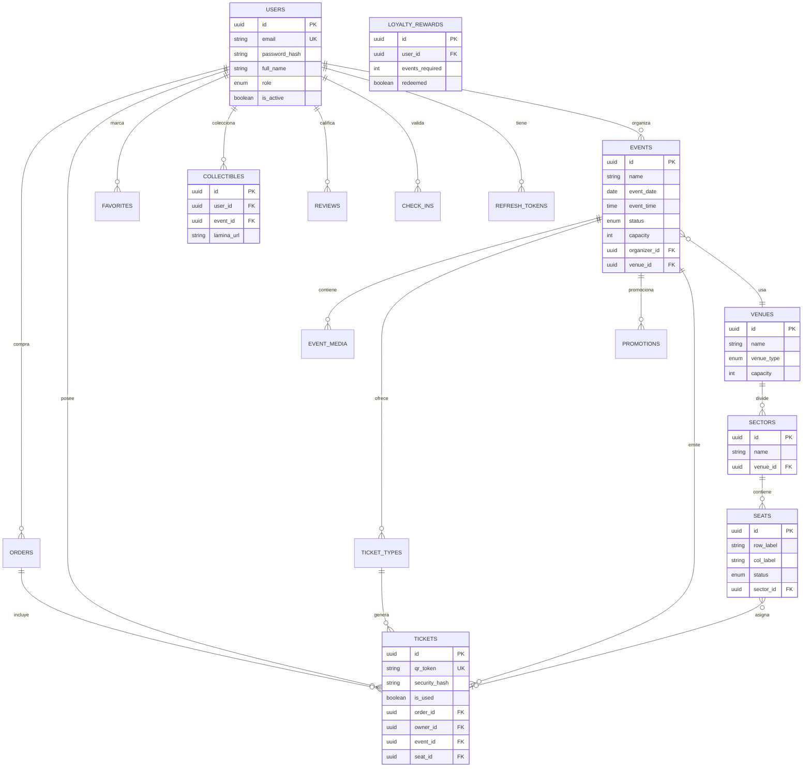

# Diagrama Entidad-Relación — TAVA

## Estados clave

| Entidad | Estados |
|---------|---------|
| Evento | borrador, programado, publicado, agotado, en_curso, finalizado, cancelado |
| Silla | disponible, reservada, vendida, bloqueada |
| Pago | pendiente, pagado, rechazado, reembolsado |
